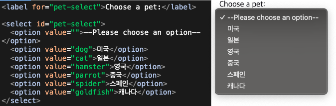
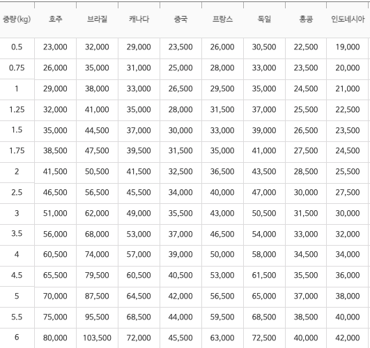

# 택배의 민족 

## 목차

- [프로젝트 소개 📖](#프로젝트-소개-📖)
- [미리보기 ](#미리보기-🌈)
- [기능 ](#기능-🕹️)
- [기술 스택 ⚒️](#기술-스택-⚒️)
- [개발 과정 🔥](#개발-과정-🔥)
- [배포 링크](#배포-링크)
- [노션 링크](#노션-링크)

## 프로젝트 소개 📖

각 택배사 웹페이지를 찾아 무게나 부피 기반으로 가격을 비교해야했던 불편함을 개선하기 위한 통합 비교 플랫폼입니다. 우체국에 근무했을 때 ems뿐 아니라 다른 택배사 가격도 알고 싶어하는 수요가 있음을 알게되었습니다. 또한, 부피 중량에 대한 정보를 얻기 어렵거나 잘 몰라 무게 기반의 가격으로 오인하는 경우가 많아 부피 중량을 함께 고려한 가격 비교가 필요함을 알게되었습니다.
이 프로젝트는 ems, ups, dhl, sf 택배사 가격을 비교할 수 있으며, 부피 중량 및 적용된 무게를 알려주어 사용자의 편의를 높였습니다.

## 미리보기


<br>
<br>

## 기능

<h3>1. 국가 선택 </h3>

- 100여개 국가를 선택 가능하여 사용자의 폭넓은 이용을 가능하게 하였습니다.
<br>
<br>
<h3>2. 무게와 부피 입력 </h3>

- 무게와 부피를 한페이지에 입력하여 사용자의 편의를 돕습니다.
- 부피 중량과 무게와 비교하여 적용 무게를 알려줍니다.
<br>
<br>
<h3>3. 택배사 가격 비교 </h3>

- 택배사 가격 비교 페이지에서 ems, ups(ems프리미엄), dhl, sf 택배사 요금을 가격순으로 정렬해 놓아 비교할 수 있습니다.
<br>
<br>
<h3>4. 무게와 부피 수정 가능 </h3>

- 비교 페이지에서 수정 버튼을 눌러 무게와 부피를 수정할 수 있습니다.
- 가격을 본 후 예산 상황에 따라 무게 부피를 수정하기 편하도록 하였습니다.
<br>
<br>
<h3>5. 사용자 입력에 따라 버튼 생성 </h3>

- 사용자가 국가를 선택하면 다음 버튼이 생성되고 무게와 부피를 입력하면 가격비교버튼이 생성되도록 하여 값이 없을 때 예외 처리 하였습니다.
  <br>
  <br>

## 기술 스택 ⚒️

- 프론트엔드: React, TailwindCSS
  <br>
  <br>
- 백엔드(크롤링): Node.js, Express, Playwright
  <br>
  <br>
- 배포: Vercel, render
  <br>
  <br>

  크롤링 과정을 Playwright로 한 이유는?

  1. 동적 콘텐츠를 안정적으로 크롤링 할 수 있습니다. 예를들어 ups 요금 조회는 페이지 로드 후 몇초 뒤에 요금이 나오는데 이를 위해 내장된 대기 메커니즘을(waitForSelector) 사용할 수 있습니다. 또한 데이터를 가져올 때 스크롤을 내려야하는 경우도 있는데, Playwright의 자동 스크롤 기능으로 쉽게 구현할 수 있습니다.
  2. Playwright는 최신 프레임워크로 Puppeteer보다 더 빠른 속도로 크롤링을 할 수 있으며, 불필요한 리소스(이미지, 광고스크립트 등) 로드를 차단합니다.

## 개발 과정 🔥

<h3>1. 국가와 부피, 무게 입력에 대한 예외 처리</h3>
무게와 부피를 입력 받을 때 값이 없거나 문자라면 오류가 발생할 수 있습니다.  
그래서  사용자가 입력한 무게와 부피를 Number로 변환하였고, 빈칸이거나 숫자가 아니라면 falsy 값이라 생각하여 예외처리를 하는 코드를 짰습니다. 또한 제공하는 서비스의 무게와 부피 값이 정해져있어 무게 20kg 초과, 가로 150cm 초과, 높이와 너비의 합이 300cm 초과일 때 예외처리를 하였습니다.

```javascript
 handleGoComparisonClick: (e) => {
    let inputArray = e.target.value.split(",");
    let weight = Number(inputArray[0]);
    let width = Number(inputArray[1]);
    let length = Number(inputArray[2]);
    let height = Number(inputArray[3]);

    if (!weight || !width || !length || !height) {
      set({ isWeightAlertModalOpen: true })
      set({ weight: "", width: "", length: "", height: "" })
    } else if (Number(inputArray[0]) > 20) {
      set({ isWeightover: true })
      set({ weight: "" })
    } else if (width > 150 || (length * 2 + height * 2) > 300) {
      set({ isVolumeAlertModalOpen: true })
    } else {
      set({ firstVolumeWeight: parseFloat((width * length * height / 6000).toFixed(1)) });
      set({ secondVolumeWeight: parseFloat((width * length * height / 5000).toFixed(1)) });
      set({ isComparison: true, landingPage: false, isNextWeightAndVolume: false })
    }
  },
```

'사용자가 입력했을 때 버튼이 생기도록 하면 더 안전하지 않을까?' 라는 생각이 들어 국가 선택 후 버튼이 생기도록 opacity를 이용하여 UI를 만들었습니다.

```javascript
<div
  className={`mt-24 transition-opacity duration-1500 ${
    selectedCountry ? "opacity-100" : "opacity-0"
  }`}
>
  <button
    onClick={handleGoWeightInputClick}
    className="bg-blue-600 text-white text-3xl p-4 
              rounded-lg hover:bg-blue-700 transition-transform 
              duration-300 ease-in-out transform hover:scale-105"
  >
    무게와 부피 입력하기
  </button>
</div>
```

무게와 부피 또한 모두 입력했을 때 다음으로 갈 수 있는 버튼을 만들었습니다.

```javascript
<div
  className={`mt-12 transition-opacity duration-1500 ${
    weight && width && length && height ? "opacity-100" : "opacity-0"
  }`}
>
  <button
    onClick={handleGoComparisonClick}
    value={`${weight}, ${width}, ${length}, ${height}`}
    className="bg-blue-600 text-white text-3xl p-4 rounded-lg hover:bg-blue-700 transition-transform duration-300 ease-in-out transform hover:scale-105"
  >
    가격 비교하기
  </button>
</div>
```

<h3>2. 국가 옵션 리스트</h3>
100여개 되는 국가의 리스트를 아래와같이 하나 하나 입력해야할까?
<br>
<br>

<br>
<br>
 또한, 대량의 국가 리스트를 하나 하나 스크롤을 내려가며 찾는 것은 사용자에게 불편함을 줄 수 있다는 생각이 들었습니다.
사용자가 직접 검색하고 '미'만 쳐도 미국이 뜨게끔 만들 수 있을까에 대한 고민으로 React-Select 라이브러리를 사용하였습니다.

```javascript
div className="justify-items-center">
            <div className="mt-16 text-4xl">도착국가를 입력해주세요.</div>
            <div className="mt-16">
              <Select
                options={countryList}
                placeholder="도착 국가를 입력해 주세요"
                className="text-2xl w-80 appearance-none outline-none text-gray-500"
                onChange={handleSelectedCountryChange}
                value={countryList.label}
              />
            </div>
          </div>
```

React-Select의 options 속성은 객체 배열을 받아서 각 객체가 드롭다운의 하나의 옵션을 나타냅니다. 일일히 컴포넌트에서 입력할 필요없이 대량의 국가리스트를 가져올 수 있었습니다.

```javascript
const countryList = [
  { value: "GR", label: "그리스 GREECE" },
  { value: "NG", label: "나이지리아 NIGERIA" },
  { value: "NL", label: "네덜란드 NETHERLANDS" },
  { value: "NP", label: "네팔 NEPAL" },
  { value: "NO", label: "노르웨이 NORWAY" },
  { value: "NZ", label: "뉴질랜드 NEW ZEALAND" },
  { value: "DK", label: "덴마크 DENMARK" },
  { value: "DO", label: "도미니카공화국 DOMINICAN REPUBLIC" },
  { value: "DE", label: "독일 GERMANY" },
  ...
```

또한, React-Select를 통해 검색 및 자동완성 기능을 구현할 수 있었습니다.


<h3>3. 요금 정보 가져오기</h3>  
요금 정보를 어떻게 가져올지 방법에 대한 세 가지 고민이 있었습니다.  
1. 정적데이터를 입력하여 가져오는 것.
<br>
2. API를 사용하기.
<br>
3. 관련 사이트를 크롤링하기.
<br>
처음에 ems요금을 가져올 때 정적데이터를 입력하여 가져오도록 하였습니다.

<div style="display: flex; align-items: center;">
  
  
</div>
<br>
<br>
그러나 이는 많은 시간이 소요되며, 오타가 날 수도 있기에 다른 택배사 요금은 API를 생각했습니다.
ups는 api 신청이 사업자만 가능했고 dhl와 fedex의 경우 sandbox test환경에서 api를 진행했는데, 보내는 국가가 미국이어야지만 요금 조회가 나왔습니다. 결국 크롤링을 통해 진행하게 되었습니다.

<br>
<br>
크롤링은 처음 해보는 것이었지만, 앞으로도 웹 페이지의 데이터를 자동으로 수집하는 과정이 필요할 수 있으며, 개발자는 안해본 것도 필요에 따라 배우고 해야겠다는 생각이 들어 도전해 보았습니다. 먼저 클라이언트로부터 요청을 받아 크롤링을 진행하는 서버를 express로 만들었습니다.
cors 설정을 도와주는 라이브러리를 사용하여 클라이언트가 서버에 요청을 보낼 때 cors제약에 따른 오류가 발생하지 않도록 하였습니다. 클라이언트로부터 받은 json 데이터를 파싱하기 위해 body-parser 라이브러리를 사용하였습니다.

```javascript
import express from "express";
import cors from "cors";
import bodyParser from "body-parser";

const app = express();
app.use(
  cors({
    origin: "https://minjock-of-taeckbae.vercel.app",
  })
);

const port = 5002;

const jsonParser = bodyParser.json();

app.post("/scrape_ups", jsonParser, async function scrapeUps(req, res) {});
```

Playwright를 사용하여 웹페이지를 자동으로 열고 사용자가 요청한 정보를 기반으로 페이지 상호작용을 수행했습니다. 이 과정에서 크롤링하는 사이트에 따라 코드를 다르게 짜야하므로 사이트의 개발자도구 Element를 탐색하였습니다. 주의했던 점은 요금 조회 경우 크롤링하는 사이트에서의 로드 시간을 고려하며 코드를 짜는 것입니다. 충분한 대기 시간을 넣어 빈 값을 가져오지 않도록 하였습니다.

```javascript
await page.waitForSelector('text="조회하기"', { timeout: 10000 });
await page.getByText("조회하기").click();
await page.waitForTimeout(1000);

await page.waitForSelector("#spanPrc", { timeout: 30000 });

const rate = await page.$eval("#spanPrc", (el) => el.textContent);
res.send(rate);
```

또한, dhl, sf 택배사 크롤링은 같은 사이트에서 하면서 for문을 사용하여 한 코드에서 두 번 크롤링을 하도록 설계하였습니다. 그런데 dhl, sf 택배사에 따라 가능한 국가가 달라 사용자가 입력한 국가를 크롤링 과정에서 브라우저가 못찾을 때 오류가 발생하였습니다. 이 해결을 위해 아래와 같이 sf, dhl 가능 국가를 따로 리스트로 만들었습니다.

<br>
<br>

```javascript
const sfCountries = {
  "GR": "그리스",
  "NL": "네덜란드",
  "NZ": "뉴질랜드",
  "TW": "대만",
  "DK": "덴마크",
  "DE": "독일",
  "MO": "마카오",
  "MY": "말레이시아",
  "US": "미국",
  "BN": "브루나이",
```

<br>
<br>
그리고 dhl과 sf 택배사에 맞는 국가리스트를 갖도록 하고 국가가 없을때는 0을 반환하도록 하였습니다.
추후 프론트엔드에서 요금이 0일때는 비교 카드 섹션을 만들지 않도록 하였습니다.

<br>
<br>

```javascript
 for (const carrier of ["DHL", "SF"]) {
      const countryList = carrier === "DHL" ? dhlCountries : sfCountries;

      if (!countryList[countryCode]) {
        rates[carrier] = "0";
        continue;
      }

```

<h3>4. 요금 가격순 정렬 및 관련 택배사 데이터 매칭</h3>
가져온 요금을 가격순으로 정렬하는 것은 어렵지 않았습니다. 그러나 가격 순은 입력한 정보에 따라 매번 달라지는데, 그 가격순에 맞는 택배사 정보(로고, 부피중량 계산 등)이 매칭되게 하는 함수를 만들어야했습니다.

```javascript
function Checkcheeprate() {
  let rateList = [UpsRate, emsRate, SfRate, dhlRate];

  rateList.sort(function (a, b) {
    return a - b;
  });
  return rateList;
}
```

정렬된 요금 순서에 따라 각 택배사의 로고, 부피 계산 방식, 무게 등의 데이터를 매칭하도록 하는 함수 match를 만들었습니다. 정렬된 가격에 따른 결과를 result 객체에 저장하여 반환하도록 하였습니다.

```javascript
function match() {
  let rateList = [UpsRate, emsRate, SfRate, dhlRate];
  const result = {
    firstImage: "",
    secondImage: "",
    thirdImage: "",
    forthImage: "",
    firstVolumeInfo: "",
    secondVolumeInfo: "",
    thirdVolumeInfo: "",
    forthVolumeInfo: "",
    firstVolumeValue: "",
    secondVolumeValue: "",
    thirdVolumeValue: "",
    forthVolumeValue: "",
    firstWeight: "",
    secondWeight: "",
    thirdWeight: "",
    forthWeight: "",
  };

  for (let i = 0; i < rateList.length; i++) {
    if (Checkcheeprate()[0] === rateList[i]) {
      if (rateList[i] === emsRate) {
        result.firstImage = "/emslogo.png";
        result.firstVolumeInfo = "(가로x세로x높이) ➗ 6000";
        result.firstVolumeValue = firstVolumeWeight;
        result.firstWeight = realWeight.ems;
      } else if (rateList[i] === UpsRate) {
        result.firstImage = "/upslogo.png";
        result.firstVolumeInfo = "(가로x세로x높이) ➗ 6000";
        result.firstVolumeValue = firstVolumeWeight;
        result.firstWeight = realWeight.ups;
      } else if (rateList[i] === SfRate) {
        result.firstImage = "/sflogo.png";
        result.firstVolumeInfo = "(가로x세로x높이) ➗ 5000";
        result.firstWeight = realWeight.sf;
        result.firstVolumeValue = secondVolumeWeight;
      } else if (rateList[i] === dhlRate) {
        result.firstImage = "/dhllogo.png";
        result.firstVolumeInfo = "(가로x세로x높이) ➗ 5000";
        result.firstVolumeValue = secondVolumeWeight;
        result.firstWeight = realWeight.dhl;
      }
    }
    if (Checkcheeprate()[1] === rateList[i]) {
      if (rateList[i] === emsRate) {
        result.secondImage = "/emslogo.png";
        result.secondVolumeInfo = "(가로x세로x높이) ➗ 6000";
        result.secondVolumeValue = firstVolumeWeight;
        result.secondWeight = realWeight.ems;
      } else if (rateList[i] === UpsRate) {
        result.secondImage = "/upslogo.png";
        result.secondVolumeInfo = "(가로x세로x높이) ➗ 6000";
        result.secondVolumeValue = firstVolumeWeight;
        result.secondWeight = realWeight.ups;
      } else if (rateList[i] === SfRate) {
        result.secondImage = "/sflogo.png";
        result.secondVolumeInfo = "(가로x세로x높이) ➗ 5000";
        result.secondVolumeValue = secondVolumeWeight;
        result.secondWeight = realWeight.sf;
      } else if (rateList[i] === dhlRate) {
        result.secondImage = "/dhllogo.png";
        result.secondVolumeInfo = "(가로x세로x높이) ➗ 5000";
        result.secondVolumeValue = secondVolumeWeight;
        result.secondWeight = realWeight.dhl;
      }
    }
    if (Checkcheeprate()[2] === rateList[i]) {
      if (rateList[i] === emsRate) {
        result.thirdImage = "/emslogo.png";
        result.thirdVolumeInfo = "(가로x세로x높이) ➗ 6000";
        result.thirdVolumeValue = firstVolumeWeight;
        result.thirdWeight = realWeight.ems;
      } else if (rateList[i] === UpsRate) {
        result.thirdImage = "/upslogo.png";
        result.thirdVolumeInfo = "(가로x세로x높이) ➗ 6000";
        result.thirdVolumeValue = firstVolumeWeight;
        result.thirdWeight = realWeight.ups;
      } else if (rateList[i] === SfRate) {
        result.thirdImage = "/sflogo.png";
        result.thirdVolumeInfo = "(가로x세로x높이) ➗ 5000";
        result.thirdVolumeValue = secondVolumeWeight;
        result.thirdWeight = realWeight.sf;
      } else if (rateList[i] === dhlRate) {
        result.thirdImage = "/dhllogo.png";
        result.thirdVolumeInfo = "(가로x세로x높이) ➗ 5000";
        result.thirdVolumeValue = secondVolumeWeight;
        result.thirdWeight = realWeight.dhl;
      }
    }
    if (Checkcheeprate()[3] === rateList[i]) {
      if (rateList[i] === emsRate) {
        result.forthImage = "/emslogo.png";
        result.forthVolumeInfo = "(가로x세로x높이) ➗ 6000";
        result.forthVolumeValue = firstVolumeWeight;
        result.forthWeight = realWeight.ems;
      } else if (rateList[i] === UpsRate) {
        result.forthImage = "/upslogo.png";
        result.forthVolumeValue = "(가로x세로x높이) ➗ 6000";
        result.forthVolumeValue = firstVolumeWeight;
        result.forthWeight = realWeight.ups;
      } else if (rateList[i] === SfRate) {
        result.forthImage = "/sflogo.png";
        result.forthVolumeInfo = "(가로x세로x높이) ➗ 5000";
        result.forthVolumeValue = secondVolumeWeight;
        result.forthWeight = realWeight.sf;
      } else if (rateList[i] === dhlRate) {
        result.forthImage = "/dhllogo.png";
        result.forthVolumeInfo = "(가로x세로x높이) ➗ 5000";
        result.forthVolumeValue = secondVolumeWeight;
        result.forthWeight = realWeight.dhl;
      }
    }
  }
  return result;
}
```

정렬된 요금 순서에 맞는 택배사 정보를 하나의 객체로 묶어 배열로 생성하여 map을 통해 카드를 생성하기 수월하게 만들었습니다.

```javascript
const cardArray = [
{
country: selectedCountry,
rate: Checkcheeprate()[0],
weight: match().firstWeight,
image: match().firstImage,
volumeInfo: match().firstVolumeInfo,
volumeValue: match().firstVolumeValue,
},
{
country: selectedCountry,
rate: Checkcheeprate()[1],
weight: match().secondWeight,
image: match().secondImage,
volumeInfo: match().secondVolumeInfo,
volumeValue: match().secondVolumeValue,
},
{
country: selectedCountry,
rate: Checkcheeprate()[2],
weight: match().thirdWeight,
image: match().thirdImage,
volumeInfo: match().thirdVolumeInfo,
volumeValue: match().thirdVolumeValue,
},
{
country: selectedCountry,
rate: Checkcheeprate()[3],
weight: match().forthWeight,
image: match().forthImage,
volumeInfo: match().forthVolumeInfo,
volumeValue: match().forthVolumeValue,
},

```

코드를 짜고 나서 문제가 있음을 발견했습니다. 5번째 택배사를 추가해야 하는 경우, 새로운 택배사의 이미지, 부피 계산법, 무게 정보를 객체에 추가해야만 합니다. 이러한 방식은 확장성이 낮고 택배사 추가가 반복될수록 코드가 길어지고 유지보수가 어려워짐을 느꼈습니다.

이를 해결하기 위해 택배사 정보를 미리 매핑한 후 요금에 따라 정렬 및 데이터를 생성하는 방식을 적용하도록 하는 것이 좋을 것 같습니다.

<h3>5. 크롤링 속도</h3>
처음에는 아래 코드와 같이 api 요청을 따로 따로 보내는 방식으로 요금 정보를 가져왔습니다.

<br>
<br>

```javascript
axios
  .post("http://127.0.0.1:5000/scrape", {
    countryCode: selectedCountry,
    weight: realWeight.dhl,
  })
  .then((response) => {
    setDhlRate(response.data["DHL"]);
  })
  .catch((error) => {
    console.error(error);
  });
```

크롤링 작업이 느렸습니다. 그래서 여러 비동기 작업을 동시에 처리하도록 promise.all을 사용하여 최적화하였습니다.

```javascript
Promise.all(requests)
  .then((responses) => {
    setEmsRate(
      responses[0].data[realWeight.ems][selectedCountry].toLocaleString()
    );
    setUpsRate(responses[1].data.slice(0, 7));

    if (dhlSfSupportedCountries[selectedCountry]) {
      setDhlRate(responses[2].data["DHL"]);
      setSfRate(responses[3].data["SF"]);
    } else {
      setDhlRate(null);
      setSfRate(null);
    }
  })
  .catch((error) => {
    console.error(error);
  })
  .finally(() => {
    setIsLoading(false);
  });
```

로컬에서는 5-10초 정도 걸리는 것을 확인했습니다. 로컬에서도 적지 않은 시간이었지만 배포 후 크롤링의 속도가 너무 느려져 로딩 시간이 30초 이상 걸렸습니다. 택배 가격 조회를 위해 이렇게 오랜 시간이 걸리면 사용자가 큰 불편함을 느낄것이라 생각이 들었습니다.
무료와 빠른 배포를 위해 Render 서버를 사용하였지만, Render환경이 로컬 환경보다 성능이 낮은 CPU/메모리를 제공하기 때문에 느려질 수 있다는 것을 알게되었습니다.
다른 백엔드 서버를 고려하거나 크롤링 속도를 빠르게 하는 방법을 찾아야할 것 같습니다.

<br>
<br>

## 배포 링크

- [택배의 민족](https://taekmin.vercel.app/)

## 노션 링크

- [택배의 민족 프로젝트 노션 보드](https://almondine-sunfish-8d2.notion.site/139e9fa7938780148610e3ea97b391d2)
