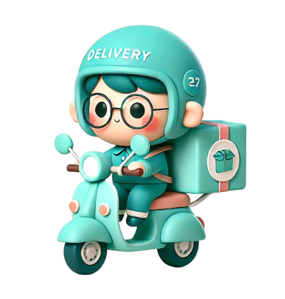
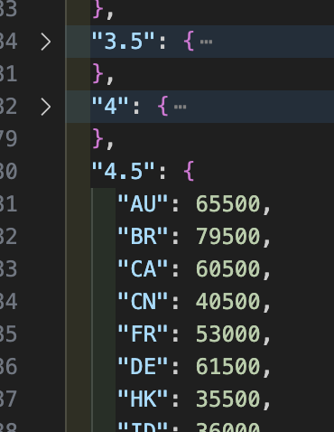
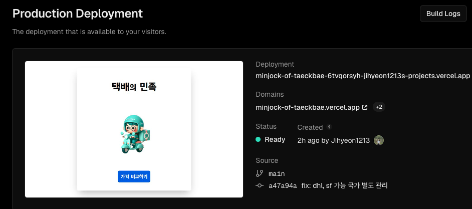

# 택배의 민족 

## 목차

- [프로젝트 소개 📖](#프로젝트-소개-📖)
- [미리보기 🌈](#미리보기-🌈)
- [기능 🕹️](#기능-🕹️)
- [기술 스택 ⚒️](#기술-스택-⚒️)
- [개발 과정 🔥](#개발-과정-🔥)
- [배포 링크](#배포-링크)
- [노션 링크](#노션-링크)

## 프로젝트 소개 📖

각 택배사 웹페이지를 찾아 무게나 부피 기반으로 가격을 비교해야했던 불편함을 개선하기 위한 통합 비교 플랫폼입니다. 우체국에 근무했을 때 ems뿐 아니라 다른 택배사 가격도 알고 싶어하는 수요가 있음을 알게되었습니다. 또한, 부피 중량에 대한 정보를 얻기 어렵거나 잘 몰라 무게 기반의 가격으로 오인하는 경우가 많아 부피 중량을 고려한 가격 비교가 필요함을 알게되었습니다.

## 미리보기 🌈


<br>
<br>

## 기능 🕹️

<h3>1. 국가 선택 🌍</h3>

- 100여개 국가를 선택 가능하여 사용자의 폭넓은 이용을 가능하게 하였습니다.
<br>
<br>
<h3>2. 무게와 부피 입력 📏</h3>

- 무게와 부피를 한페이지에 입력하여 사용자의 편의를 돕습니다.
- 부피 중량과 무게와 비교하여 적용 무게를 알려줍니다.
<br>
<br>
<h3>3. 택배사 가격 비교 📊</h3>

- 택배사 가격 비교 페이지에서 ems, ups(ems프리미엄), dhl, sf 택배사 요금을 가격순으로 정렬해 놓아 비교할 수 있습니다.
<br>
<br>
<h3>4. 무게와 부피 수정 가능 🔄</h3>

- 비교 페이지에서 수정 버튼을 눌러 무게와 부피를 수정할 수 있습니다.
- 가격을 본 후 예산 상황에 따라 무게 부피를 수정하기 편하도록 하였습니다.
<br>
<br>
<h3>5. 사용자 입력에 따라 버튼 생성 🔘</h3>

- 사용자가 국가를 선택하면 다음 버튼이 생성되고 무게와 부피를 입력하면 가격비교버튼이 생성되도록 하여 값이 없을 때 예외 처리 하였습니다.
<br>
<br>
<h4>추가할 기능</h4>

- 택배사 가격 비교 페이지에서 택배사 이름을 클릭하면 택배사 홈페이지로 이동할 수 있도록 하겠습니다.
- fedex 택배사 가격 비교 페이지 추가하겠습니다.
- 최적화로 로딩 속도를 개선하겠습니다.
  <br>
  <br>

## 기술 스택 ⚒️

- 프론트엔드: React, TailwindCSS
  <br>
  <br>
- 백엔드(크롤링): Node.js, Express, Playwright
  <br>
  <br>
- 배포: Vercel, render
  <br>
  <br>

## 개발 과정 🔥

<h3>1. 리액트 조건부 랜더링</h3>

버튼 클릭에 따라 랜딩페이지 → 국가입력 → 무게 부피 입력 → 택배사 가격비교 페이지로 이동하게 하였습니다.
<br>
<br>

```javascript
return (
  <>
    {!landingPage &&
      !isNextCountry &&
      !isNextWeightAndVolume &&
      isComparison && <ServiceComparison />}
    {!landingPage && isNextCountry && <CountryInputForm />}
    {!landingPage && isNextWeightAndVolume && !isNextCountry && (
      <WeightAndVolumeInputForm />
    )}
    {!isNextWeightAndVolume && !isNextCountry && landingPage && (
      <>
        <div className=" w-96 h-[90vh] sm:w-[28rem] md:w-[36rem]
          lg:w-[42rem] p-8 rounded-lg flex flex-col
          items-center justify-center">
          <div className="container flex flex-col items-center mt-8">
            <div className="flex items-center">
              <div className="text-6xl mb-20">
                택배<span className="text-5xl">의</span> 민족
              </div>
            </div>
        ...
    )}
  </>
);
```

<br>
<br>

<h3>2. zustand 상태관리</h3>

버튼 클릭에 따라 상태를 관리하기 위해 zustand를 사용하였습니다.
국가, 무게, 가로, 세로, 높이 등을 가격 비교 페이지 컴포넌트에서도 사용할 수 있게 전역상태관리를 하였습니다.

<br>
<br>

```javascript
  weight: "",
  isWeightAlertModalOpen: false,
  isVolumeAlertModalOpen: false,
  selectedCountry: "",
  isWeightover: false,
  width: "",
  height: "",
  length: "",
  landingPage: true,
  isNextCountry: false,
  isComparison: false,
  isNextWeightAndVolume: false,
  handlegoCountryInputClick:
  () => set({ landingPage: false, isNextCountry: true }),
  handleGoLandingPageClick:
  () => set({ landingPage: true, isNextWeightAndVolume: false,
  isNextCountry: false, weight: "" }),
  handleGoWeightInputClick:
  () => set({ isComparison: false, isNextWeightAndVolume: true,
  landingPage: false, isNextCountry: false }),

  handleWeightInputChange: (e) => {
    set({ weight: e.target.value })
  },
  handleWidthChange: (e) => {
    set({ width: e.target.value })
  },
  handleLengthChange: (e) => {
    set({ length: e.target.value })
  },
  handleHeightChange: (e) => {
    set({ height: e.target.value })
  },
```

<br>
<br>
<h3>3. 예외 처리</h3>

국가와 부피, 무게 등 입력한 값이 있어야지만 다음 버튼이 생성도되록 하였습니다.
<br>
<br>

```javascript
<div
  className={`mt-24 transition-opacity duration-1500 ${
    selectedCountry ? "opacity-100" : "opacity-0"
  }`}
>
  <button
    onClick={handleGoWeightInputClick}
    className="bg-blue-600 text-white text-3xl p-4 
              rounded-lg hover:bg-blue-700 transition-transform 
              duration-300 ease-in-out transform hover:scale-105"
  >
    무게와 부피 입력하기
  </button>
</div>
```

```javascript
<div
  className={`mt-12 transition-opacity duration-1500 ${
    weight && width && length && height ? "opacity-100" : "opacity-0"
  }`}
>
  <button
    onClick={handleGoComparisonClick}
    value={`${weight}, ${width}, ${length}, ${height}`}
    className="bg-blue-600 text-white text-3xl p-4 rounded-lg hover:bg-blue-700 transition-transform duration-300 ease-in-out transform hover:scale-105"
  >
    가격 비교하기
  </button>
</div>
```

<br>
<br>

무게와 부피를 입력했을 때 무게와 부피가 숫자가 아닐 때, 무게가 20kg 초과일 때, 가로가 150cm 초과일 때, 높이와 너비의 합이 300cm 초과일 때 예외 처리를 하였고 관련 메시지를 담은 모달을 띄웠습니다.

<br>
<br>

```javascript
 handleGoComparisonClick: (e) => {
    let inputArray = e.target.value.split(",");
    let weight = Number(inputArray[0]);
    let width = Number(inputArray[1]);
    let length = Number(inputArray[2]);
    let height = Number(inputArray[3]);

    if (!weight || !width || !length || !height) {
      set({ isWeightAlertModalOpen: true })
      set({ weight: "", width: "", length: "", height: "" })
    } else if (Number(inputArray[0]) > 20) {
      set({ isWeightover: true })
      set({ weight: "" })
    } else if (width > 150 || (length * 2 + height * 2) > 300) {
      set({ isVolumeAlertModalOpen: true })
    } else {
      set({ firstVolumeWeight: parseFloat((width * length * height / 6000).toFixed(1)) });
      set({ secondVolumeWeight: parseFloat((width * length * height / 5000).toFixed(1)) });
      set({ isComparison: true, landingPage: false, isNextWeightAndVolume: false })
    }
  },
```

<br>
<br>
<h3>4. 요금 정보 가져오기</h3>  
처음에 ems요금은 정적데이터를 입력하여 가져오도록 하였습니다.


<br>
<br>
그러나 이는 많은 시간이 소요되며, 오타가 날 수도 있기에 다른 택배사 요금은 API나 크롤링으로 가져온 것을 생각했습니다. API는 비용, 지역, 사업자 여부 문제 때문에 쉽지 않았습니다.  
<br>
<br>
크롤링은 처음 해보는 것이었지만, 앞으로도 필요할 수 있고 개발자는 안해본 것도 필요에 따라 배우고 해야겠다는 생각이 들어 도전해 보았습니다.  
playwright 공식문서를 보면서 차근차근 따라했습니다. 크롤링하는 사이트에 따라 코드를 다르게 짜야하므로 사이트의 개발자도구 Element를 탐색하였습니다.
주의했던 점은 요금 조회 경우 대기시간을 고려하며 코드를 짜는 것입니다.
충분한 대기 시간을 넣어 빈 값을 가져오지 않도록 하였습니다.

<br>
<br>

```javascript
await page.waitForSelector('text="조회하기"', { timeout: 10000 });
await page.getByText("조회하기").click();
await page.waitForTimeout(1000);

await page.waitForSelector("#spanPrc", { timeout: 30000 });

const rate = await page.$eval("#spanPrc", (el) => el.textContent);
res.send(rate);
```

<br>
<br>

또한, dhl, sf 택배사 크롤링은 같은 사이트에서 하면서 for문을 사용하여 한 코드에서 두 번 크롤링을 하도록 설계하였습니다. 그런데 dhl, sf 택배사에 따라 가능한 국가가 달라 사용자가 입력한 국가를 크롤링 과정에서 브라우저가 못찾을 때 오류가 발생하였습니다. 이 해결을 위해 아래와 같이 sf, dhl 가능 국가를 따로 리스트로 만들었습니다.

<br>
<br>

```javascript
const sfCountries = {
  "GR": "그리스",
  "NL": "네덜란드",
  "NZ": "뉴질랜드",
  "TW": "대만",
  "DK": "덴마크",
  "DE": "독일",
  "MO": "마카오",
  "MY": "말레이시아",
  "US": "미국",
  "BN": "브루나이",
```

<br>
<br>
그리고 dhl과 sf 택배사에 맞는 국가리스트를 갖도록 하고 국가가 없을때는 0을 반환하도록 하였습니다.
추후 프론트엔드에서 요금이 0일때는 비교 카드 섹션을 만들지 않도록 하였습니다.

<br>
<br>

```javascript
 for (const carrier of ["DHL", "SF"]) {
      const countryList = carrier === "DHL" ? dhlCountries : sfCountries;

      if (!countryList[countryCode]) {
        rates[carrier] = "0";
        continue;
      }

```

<br>
<br>
<h3>5. 크롤링 최적화</h3>
처음에는 아래 코드와 같이 api 요청을 따로 따로 보내는 방식으로 요금 정보를 가져왔습니다.

<br>
<br>

```javascript
axios
  .post("http://127.0.0.1:5000/scrape", {
    countryCode: selectedCountry,
    weight: realWeight.dhl,
  })
  .then((response) => {
    setDhlRate(response.data["DHL"]);
  })
  .catch((error) => {
    console.error(error);
  });
```

크롤링 작업이 느려 여러 비동기 작업을 동시에 처리하도록 promise.all을 사용하여 최적화하였습니다.

```javascript
Promise.all(requests)
  .then((responses) => {
    try {
      if (!responses[0].data) throw new Error("EMS 데이터 없음");
      if (!responses[1].data) throw new Error("UPS 데이터 없음");

      setEmsRate(
        responses[0].data[realWeight.ems][selectedCountry].toLocaleString()
      );
      setUpsRate(responses[1].data.slice(0, 7));

      if (dhlSfSupportedCountries[selectedCountry]) {
        if (!responses[2].data) throw new Error("DHL 데이터 없음");
        if (!responses[3].data) throw new Error("SF 데이터 없음");

        setDhlRate(responses[2].data["DHL"]);
        setSfRate(responses[3].data["SF"]);
      } else {
        setDhlRate(null);
        setSfRate(null);
      }
    } catch (error) {
      console.error("데이터 처리 중 오류:", error);
    }
  })
  .catch((error) => {
    console.error("API 요청 중 오류:", error);
  })
  .finally(() => {
    setIsLoading(false);
  });
```

<br>
<br>
<h3>6. 배포</h3>

- 배포는 두 가지 방법이 있었습니다.
  <br>
  <br>

  - 1. 클라이언트 배포: Vercel  
       Vercel에 프로젝트를 연결하고, 자동으로 빌드 및 배포가 이루어지도록 설정하였습니다.  
       
       <br>
       <br>
  - 2. 서버 배포: Render  
        Render는 백엔드 애플리케이션을 배포할 수 있는 플랫폼으로, Node.js 서버를 쉽게 배포할 수 있습니다. 시작 명령 설정에서는 playwright 설치 명령어를 추가하여 배포 후 크롤링이 잘 이루어지도록 하였습니다.  
        배포 후 api요청 코드에서 서버 배포한 url로 바꾸었습니다.
       <br>
       <br>

  ```javascript
    axios.post(
      "https://tackmin-comparison-1.onrender.com/scrape_ups",
      {
        countryCode: selectedCountry,
        weight: weight,
        width: width,
        length: length,
        height: height,
      },
      { withCredentials: false }
    ),
  ```

## 배포 링크

- [택배의 민족](https://taekmin.vercel.app/)

## 노션 링크

- [택배의 민족 프로젝트 노션 보드](https://almondine-sunfish-8d2.notion.site/139e9fa7938780148610e3ea97b391d2)
